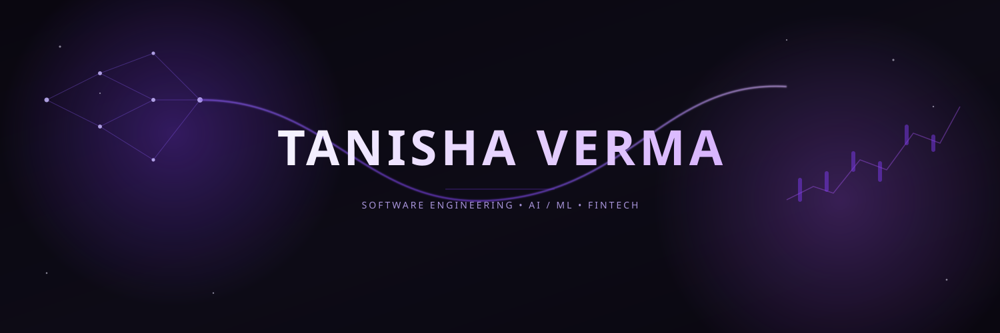

  

  

 

## 👋 About

I'm Tanisha Verma, a Computer Science student who enjoys building practical software with a growing interest in Artificial Intelligence, Machine Learning, and Financial Technology.

Whether it's designing intelligent systems, analyzing financial data, or creating interactive software, I enjoy turning ideas into projects that solve real-world problems.

---

## 🚀 Currently Building

- 🤖 AI-powered software applications
- 📈 Financial intelligence & data-driven systems
- 💻 Scalable Java projects
- 🧠 Machine Learning solutions
- 🌱 Open-source ready projects

---

## 🛠 Tech Stack

---

<h2>📊 GitHub Activity</h2>

---

<h2>🌐 Connect</h2>

<!--  -->

---

> **"Where software engineering meets AI and finance."**

